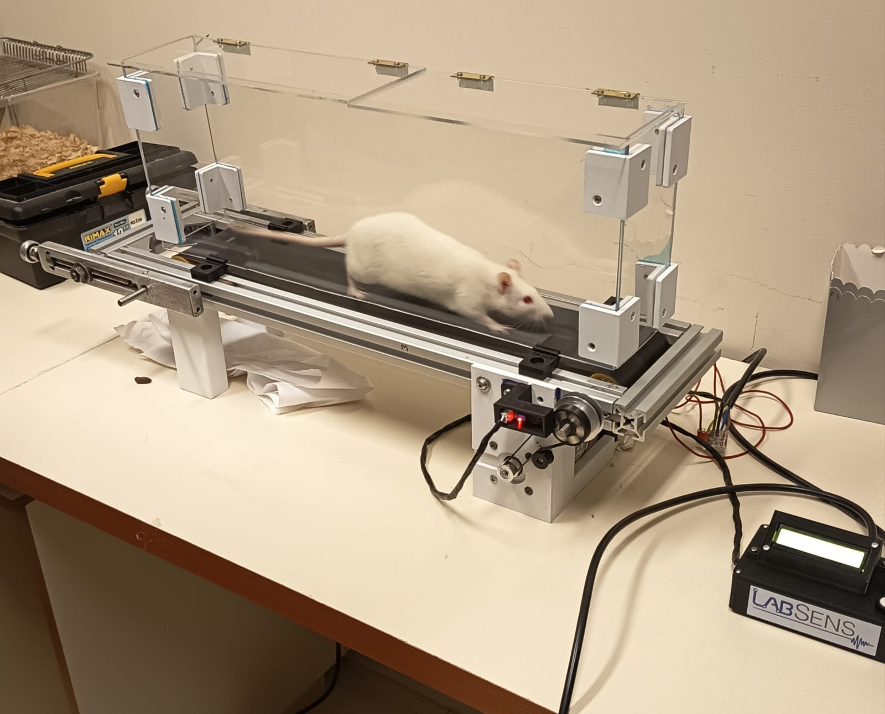
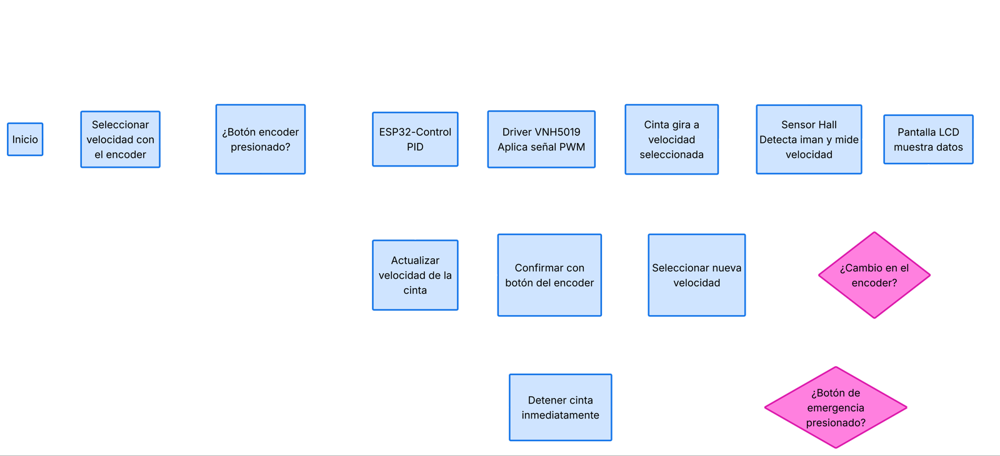
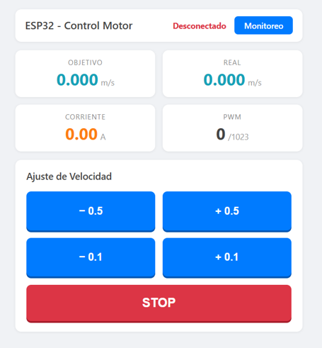
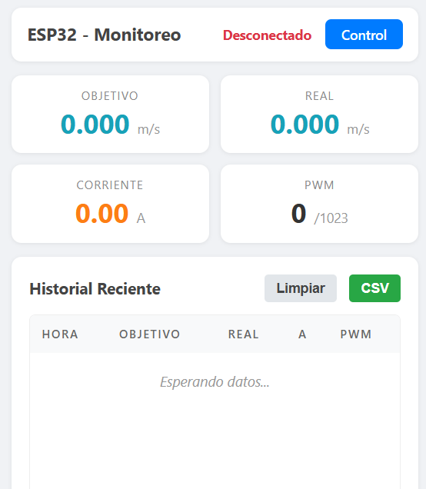
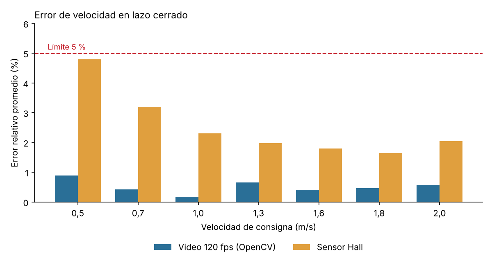

# Trotadora de velocidad controlable para roedores

Proyecto de título de Ingeniería Civil Electrónica, Pontificia Universidad Católica de Valparaíso (julio 2026). Nota: 7,0.

Prototipo de trotadora para el laboratorio de la Escuela de Kinesiología de la PUCV. Mantiene la cinta a la velocidad fijada entre 0,1 y 2,0 m/s con control PID en lazo cerrado. Validado con dos referencias independientes: **error menor a 1 % medido por video y menor a 5 % medido por el sensor interno**, en 7 velocidades entre 0,5 y 2,0 m/s.



## Contexto

El laboratorio estudia capacidades fisiológicas en roedores y no contaba con una trotadora. Comprar un equipo comercial (~USD 2.000) implicaba una inversión alta y largos plazos de importación, y en Chile hay pocos proveedores de este tipo de equipamiento. Construirlo con materiales disponibles localmente permite además replicarlo y adaptarlo a cada protocolo experimental.

Requisitos definidos a partir de protocolos publicados de ejercicio en roedores:

| Requisito | Meta | Logrado |
|---|---|---|
| Error de velocidad en lazo cerrado | < 5 % | < 0,9 % (video) · < 4,8 % (sensor Hall) |
| Rango de velocidad | 0,5 – 1,5 m/s | 0,1 – 2,0 m/s, en pasos de 0,05 m/s |
| Estabilidad en régimen permanente | < ±5 % | ±0,4 % |
| Operación suave y silenciosa | Minimizar el estrés del animal | PWM a 20 kHz, fuera del rango audible |

## Diseño mecánico

El principal desafío del proyecto fue mecánico. La estructura pasó por tres iteraciones:

1. **Chasis impreso en 3D** (descartado): holgura y desalineación de la cinta. Los alojamientos plásticos de los rodamientos no resistían la carga dinámica.
2. **Bastidor de aluminio con soportes plásticos** (descartado): más rígido, pero la cinta seguía desplazándose hacia un lado.
3. **Perfil de aluminio con alojamientos mecanizados** (final): rodamientos montados directamente sobre el aluminio y tensado fino manual. Eliminó el desplazamiento lateral de la cinta.

## Motorización

Se probaron motor BLDC, motor DC y motor paso a paso. Se eligió un **motor DC de 24 V** por su mejor torque tanto a bajas como a altas revoluciones. La relación de velocidad se ajustó con una transmisión por poleas de distinto diámetro.

## Electrónica y control



| Componente | Función |
|---|---|
| ESP32 | Lazo de control, cálculo de velocidad, interfaz local y web |
| Driver Pololu VNH5019 | Etapa de potencia del motor DC 24 V, con medición de corriente |
| Sensor de efecto Hall + 5 imanes de neodimio | Medición de velocidad en el rodillo motriz (Ø 38,5 mm) |
| Encoder rotatorio KY-040 + LCD 16x2 I²C | Ajuste de la consigna y visualización local |

**Medición de velocidad.** Una interrupción guarda el tiempo entre pulsos del sensor Hall en un buffer circular. La velocidad se calcula con la mediana de los últimos períodos, lo que descarta lecturas aisladas erróneas. El filtro anti-rebote se ajusta solo, rechazando pulsos más cortos que el 50 % de la mediana actual.

**Diente faltante (mejora posterior a la defensa).** La versión defendida usaba 6 imanes equiespaciados. Junto al profesor guía se cambió a 5 imanes en 6 posiciones, dejando una vacía, la misma técnica de las ruedas fónicas de cigüeñal en motores. El hueco produce un período del doble de largo que el firmware reconoce como inicio de vuelta. Así sabe en qué posición del rodillo está, cuenta vueltas completas sin acumular error y se resincroniza solo si pierde un pulso. El período del hueco no entra al filtro de velocidad, para no ensuciar la mediana.

**Control.** PID (librería Arduino PID) con anti-windup y PWM de 10 bits a 20 kHz. Las ganancias Kp, Ki y Kd se pueden ajustar en vivo desde un menú en el LCD, sin recompilar.

**Interfaz.** Control local con perilla y LCD, y un servidor web en el propio ESP32 para ajustar la velocidad y ver los datos en tiempo real desde el celular (WebSocket). Los datos se exportan en CSV.

| Control web | Monitoreo web |
|---|---|
|  |  |

## Validación

La velocidad se validó con dos fuentes que miden con principios físicos distintos, en 7 velocidades entre 0,5 y 2,0 m/s:

- **Externa (video):** cámara a 120 fps apuntando a una marca amarilla pintada en la cinta. Un script en Python con OpenCV segmenta la marca en espacio HSV y mide el período de cada vuelta (promedio de 20 vueltas por velocidad). Los resultados se confirmaron contando cuadro a cuadro a mano.
- **Interna (sensor Hall):** la misma medición que usa el lazo de control, registrada por puerto serial.



El error medido por video se mantuvo bajo 0,9 % en todo el rango (mejor resultado: 0,18 % a 1,0 m/s). El sensor Hall registra más error a baja velocidad (4,79 % a 0,5 m/s) por la resolución limitada que dan pocos imanes en el rodillo. Estos resultados corresponden a la versión de 6 imanes. En términos absolutos, la variación de velocidad se mantuvo entre ±0,02 y ±0,04 m/s.

**Limitación:** las mediciones de validación se hicieron con la cinta sin carga. El equipo se probó luego con una rata adulta, manteniendo una marcha estable.

## Trabajo futuro

- Inclinación regulable de la cinta (0°, 5° y 10°).
- Ensayos con animales bajo protocolos de habituación estandarizados.
- Más imanes en el rodillo para reducir el error a baja velocidad.
- Repetir la validación con la configuración de diente faltante.

## Estructura del repositorio

```
src/main.cpp           Firmware (C++, framework Arduino)
include/               Configuración de pines, motor y Wi-Fi
data/                  Páginas web servidas desde LittleFS
docs/                  Arquitectura, análisis de pines e imágenes
log_serial.py          Registro de velocidad por serial a CSV
test hsv.py            Medición de velocidad por video (OpenCV, SciPy)
```

## Compilar y cargar

Requiere [PlatformIO](https://platformio.org/).

```bash
pio run --target upload        # firmware
pio run --target uploadfs      # páginas web a LittleFS
pio device monitor             # monitor serial (460800 baudios)
```

## Autor

Rafael Capurro Carrillo — Ingeniero Civil Electrónico, PUCV
rafael.capurro.c@mail.pucv.cl
